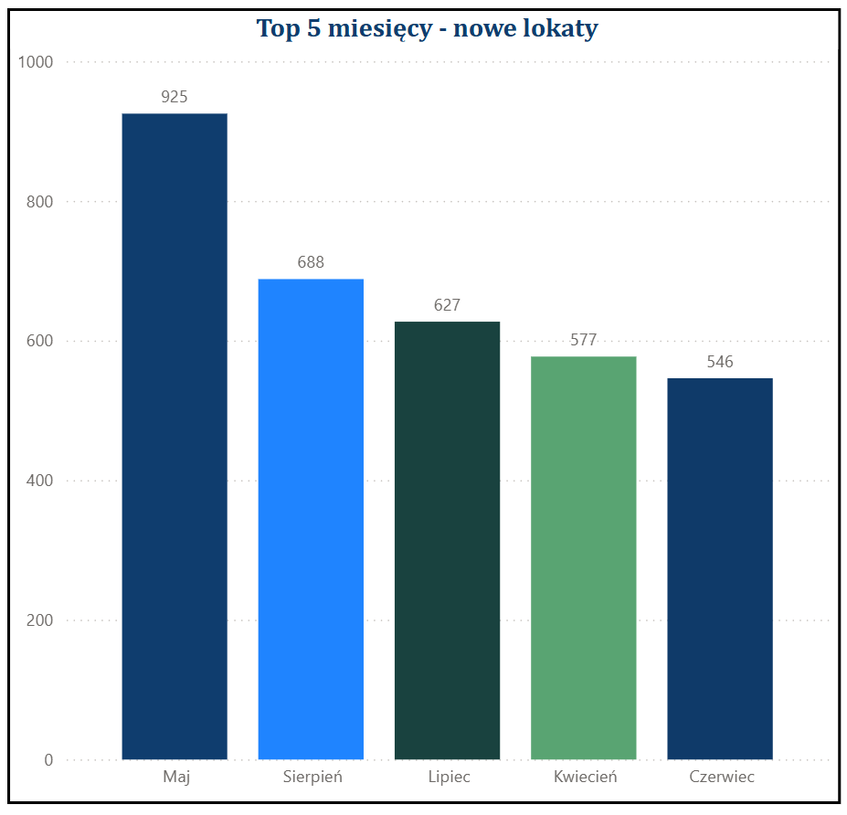
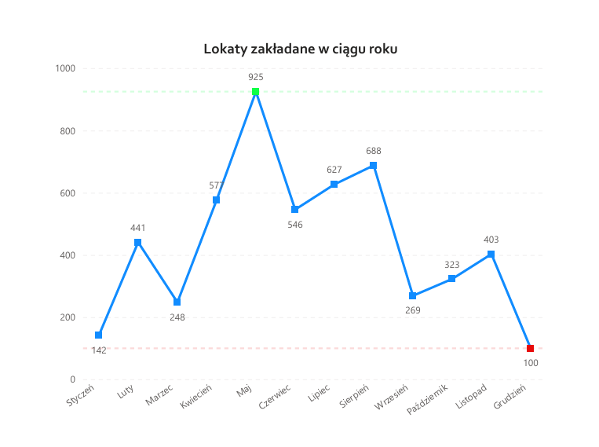
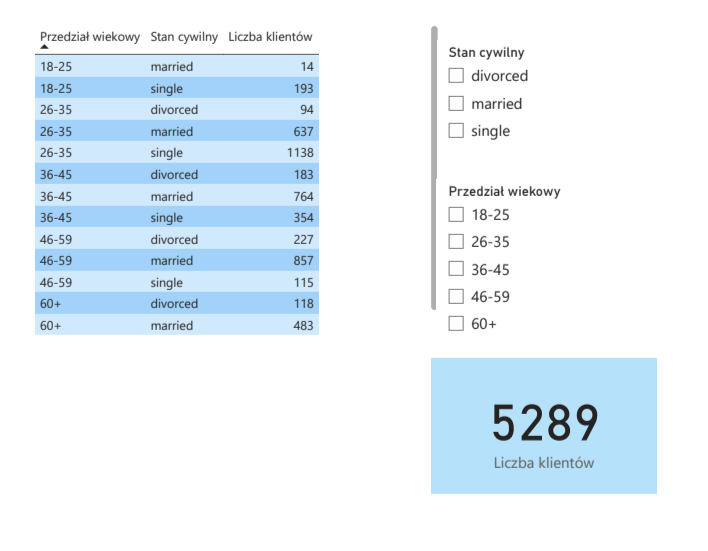
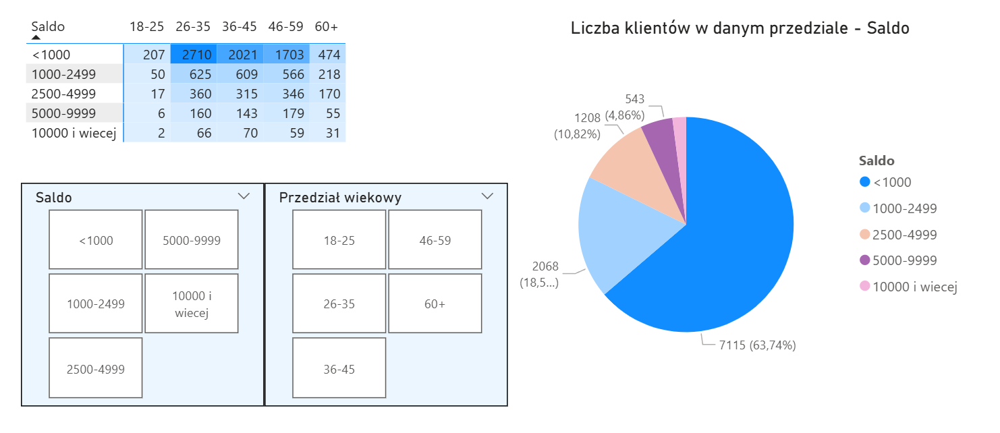

# 📊 Portfolio SQL – Analiza klientów banku

Projekt pokazujący moje umiejętności w zakresie **SQL, analizy danych i wizualizacji wyników w Power BI**.  
Na podstawie przykładowej bazy klientów banku przygotowałem zapytania SQL, zestawienia i wizualizacje, które mogą wspierać decyzje biznesowe (np. segmentacja klientów, skuteczność kampanii, analiza sald).

---

## 🗂 Struktura repozytorium

- [`/sql`](./sql) – wszystkie zapytania SQL:
  - [`AnalizyBankowe.sql`](./sql/AnalizyBankowe.sql) – główne analizy klientów banku
  - [`widok_Klienci_segmentacja.sql`](./sql/widok_Klienci_segmentacja.sql) – widok do segmentacji klientów wg wieku
- [`/data`](./data) – wyniki zapytań zapisane do plików `.csv`
- [`/images`](./images) – wizualizacje i wykresy w formie `.png`
- [`README.md`](./README.md) – opis projektu

---

## 🧾 Przykładowe analizy SQL

- **Segmentacja klientów wg wieku i stanu cywilnego** – widok `Klienci_segmentacja`
- **Top 5 miesięcy z najwyższą skutecznością kampanii**
- **Analiza zawodów i średnich sald**
- **Porównanie skuteczności kampanii wg zawodu**
- **Skuteczność kampanii w czasie (miesiąc po miesiącu)**

👉 [Pełny plik z zapytaniami SQL](./sql/sqlAnalizyBankowe.sql)

---

## 📊 Wizualizacje

Przykładowe wykresy stworzone na podstawie danych:

- **Top 5 miesięcy – liczba klientów z lokatą**  
  

- **Skuteczność kampanii w ujęciu rocznym (liniowy)**  
  

- **Mini raport z segmentacją klientów (Power BI)**  
  

---
### Dashboard: struktura salda wg wieku

Poniżej przykładowa analiza klientów w podziale na saldo i przedział wiekowy.  
Widok zawiera:
- macierz krzyżową (saldo × przedział wiekowy),
- wykres kołowy pokazujący strukturę klientów wg salda,
- fragmentatory umożliwiające interaktywną analizę.

---

👉 Wniosek: większość klientów posiada saldo poniżej 1000, przy czym największą część tej grupy stanowią osoby w wieku 26–45 lat.
## 📌 Wnioski biznesowe

- Najbardziej skłonni do zakładania lokat są **studenci (74,72%)** oraz osoby w wieku **26–35 lat, single**.
- Najlepsze miesiące na prowadzenie kampanii to okres **kwiecień–sierpień**.
- Średni balans klientów z lokatą jest wyższy niż u klientów bez lokaty, co wskazuje na atrakcyjniejszą grupę docelową.
- Segmentacja klientów wg wieku i stanu cywilnego pozwala lepiej personalizować kampanie.

---

## ⚙️ Technologie

- **SQL Server** – tworzenie zapytań i widoków
- **Power BI** – wizualizacje danych, dashboard
- **Excel** – dodatkowa analiza tabelaryczna
- **GitHub** – dokumentacja i wersjonowanie

---

## 👤 Kontakt

Autor: Ernest K.  
🔗 [LinkedIn](https://www.linkedin.com/in/ernest-k98/)  
📧 e-mail: (ernest.krzysik@onet.pl)  

